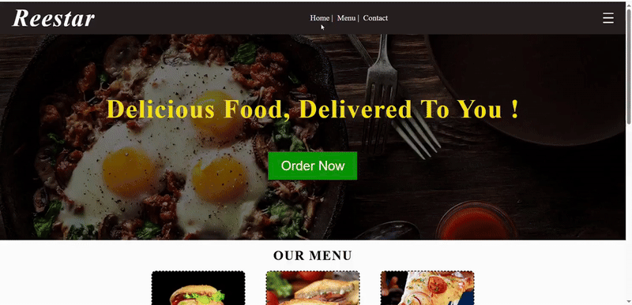

<h1 align="center">🍽️ Reestar Restaurant Website</h1>

  🌐 <strong>Live Demo</strong> 
  👉 <a href="https://keerthana28116.github.io/reestar-css-practice/" target="_blank">
    https://keerthana28116.github.io/reestar-css-practice/
  </a>

  ⚠️ <em>This is a personal HTML & CSS practice project.</em> 
  <em>Not associated with any real restaurant or business.</em>

---

## 📌 Overview
**Reestar** is a beginner-friendly **restaurant landing page** built to practice frontend fundamentals.  
This project focuses on creating a clean layout, improving visual hierarchy, and understanding responsive design using pure **HTML & CSS**.

---

## 🛠️ Tech Stack
- 🧱 **HTML** – Structure  
- 🎨 **CSS** – Styling & layout  
- 🌍 **GitHub Pages** – Hosting  

---

## 📂 Project Structure

reestar-css-practice/

├── index.html # Main webpage

├── style.css # Styling file

└── image/ # Image assets

---

## 🚀 Project Demo

  

---

## ✨ Features
- 🖼️ Hero section with background image & overlay  
- 🧾 Menu cards with smooth hover effects  
- 🏪 About Us section  
- 📞 Contact section  
- 🎯 Clean UI with readable layout  
- 🧑‍💻 Beginner-friendly code structure  

---

## 📘 What I Learned
- 📐 Using **Flexbox** for layouts  
- 🎨 Styling buttons, cards, and sections  
- 🖼️ Managing image paths correctly  
- ✨ Creating hover animations with CSS  
- 🚀 Deploying a static website using **GitHub Pages**  

---

## 👩‍💻 Author
**Keerthana P**

- 📧 **Email:** keerthana28116@gmail.com  
- 💼 **LinkedIn:**  
  👉 https://www.linkedin.com/in/keerthana-p-954242305  

---

  ⭐ <em>If you find this project useful, feel free to star the repository!</em>

